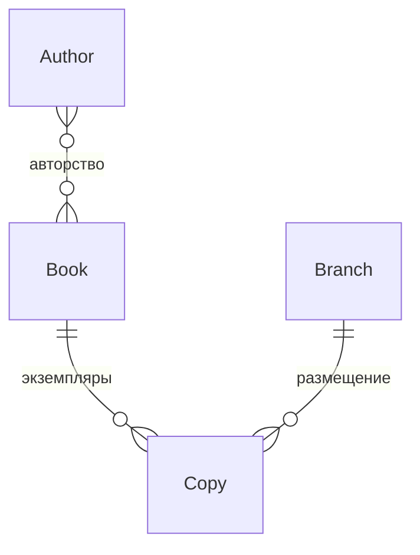

# Схема данных проекта «Библиотека»

Author, Book, Branch и Copy реализованы.

## Связи сущностей

- Автор может быть связан с несколькими книгами или не иметь книг.
- Книга может иметь нескольких авторов или быть без указания авторов.
- Связь Author и Book реализована через промежуточную таблицу.
  Пара «книга — автор» в ней уникальна.
- По плану книга и филиал могут иметь от нуля до нескольких экземпляров.
- Каждый экземпляр должен относиться ровно к одной существующей
  книге и одному существующему филиалу.

## Поля сущностей

| Сущность | Поле | Назначение и ограничения |
|---|---|---|
| Author | id | Автоматический первичный ключ |
| Author | full_name | Обязательное имя, максимум 200 символов |
| Book | id | Автоматический первичный ключ |
| Book | title | Обязательное название, максимум 300 символов |
| Book | publication_year | Необязательный год; API принимает от 1 до 32767 или null |
| Book | authors | Связь многие ко многим с Author; обратное имя — books |
| Branch | id | Автоматический первичный ключ |
| Branch | name | Обязательное название, максимум 200 символов |
| Branch | address | Обязательный адрес, максимум 500 символов |
| Copy | id | Автоматический первичный ключ |
| Copy | inventory_number | Уникален во всей системе |
| Copy | book | Обязательная связь с существующей книгой |
| Copy | branch | Обязательная связь с существующим филиалом |

authors — поле связи Django, а не отдельный столбец таблицы книг.
В API книг эта связь задаётся списком author_ids.

## Правила удаления

| Операция | Требуемое поведение | Состояние реализации |
|---|---|---|
| Удаление автора с книгами | Запретить удаление | API возвращает 409; прямое удаление через ORM этим обработчиком не защищено |
| Удаление книги с экземплярами | Запретить удаление | Реализовано: PROTECT, ответ API 409, интеграционные тесты |
| Удаление филиала с экземплярами | Запретить удаление | Реализовано: PROTECT, ответ API 409, интеграционные тесты |
| Удаление книги без экземпляров | Авторы сохраняются | Реализовано в API книг |

Связи Copy с Book и Branch используют on_delete=PROTECT.
API преобразует запрет удаления в ответ 409.
Сохранность данных при отказе проверяется тестами.

## Пример

Если в двух филиалах находятся три физических экземпляра
одного издания, создаются одна запись Book и три записи Copy.
Каждая запись Copy указывает на эту книгу и на свой филиал.